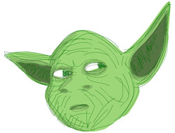

yoda
====


etcd v2 client for monitoring changes to the force - useful for networks that are changing dynamically.

Yoda gives you 2 things:

 * a node.js event listener that reacts to changes in network topology (endpoints coming and going)
 * a bash script that an orchestration script calls to register and un-register endpoints



## example 1 - node.js <-> Mongo

### node.js client

Somewhere on a small lonely planet - a plucky little node script wants to connect to some Mongo databases (or ZeroMQ sockets or any TCP thing).

We know we have an etcd server running on 127.0.0.1:4001 and so we tell Yoda to connect to it to get updates about Mongos.

```js
var Yoda = require('yoda');

// hostname + port of the etcd server
var yoda = new Yoda('127.0.0.1', 4001);

// location will emit events for anything below /mongo
var location = yoda.connect('/mongo');

// listen for servers arriving
location.on('add', function(route, data){

	// route will be the id of the server
	console.log('server id: ' + route);

	// data is a string at this point - encode how you like!
	console.log(data);

	// we probably want to connect to the mongo server at this point
})

```

### bash client

Meanwhile - in amoungst the alliance fleet - we have a Mongo spawning bash script that knows the IP of the server it is running a Mongo database on.

```bash

# the IP address of the mongo server we are booting
MONGO_IP='192.168.1.120'

# first run a mongo container using docker
MONGO_CONTAINER=$(docker run -p 27017 -t quarry/mongo)

# now get the port it is listening
MONGO_PORT=$(docker port $MONGO_CONTAINER 27017)

# now lets tell yoda about the server
yoda set /mongo/$MONGO_CONTAINER $MONGO_IP:$MONGO_PORT
```

### bootstrap

A command to boot 2 servers and register them under '/servers' with yoda:

```
$ node server.js 5678 &
$ node server.js 5679 &
$ yoda set /servers/1 tcp://127.0.0.1:5678
$ yoda set /servers/2 tcp://127.0.0.1:5679
```

## example 2 - ZeroMQ <-> ZeroMQ

A brokerless ZeroMQ REQ/REP network where multiple clients connect to multiple servers - a feel-the-force mesh!

### server.js

```js
#!/usr/bin/env node
var zmq = require('zmq')
  , sock = zmq.socket('rep');

var port = process.argv[2] || 8791;
sock.on('message', function(msg){
	sock.send('padowan');
})

sock.bindSync('tcp://127.0.0.1:' + port);
```

### client.js

A ZeroMQ REQ client that connects to servers registered under '/servers' with yoda:

```js
var zmq = require('zmq')
  , server_socket = zmq.socket('req')
  , Yoda = require('yoda');

var yoda = new Yoda('127.0.0.1', 4001);
var server_pool = yoda.connect('/servers');

server_pool.on('add', function(route, endpoint){
	server_socket.connect(endpoint);
})

setInterval(function(){
	// this is load balanced across the server sockets
	server_socket.send('jedi_skills?');
}, 1000)
```

## installation

### node.js

The node.js part is so your app can listen to changes in the network and connect/disconnect to endpoints as they come and go.

	$ npm install yoda --save

### bash

The bash part is so your orchestration script can write changes to the network as you are spawning/killing processes.

	$ wget -qO- https://raw.github.com/binocarlos/yoda/master/bootstrap.sh | sudo bash

### etcd server

You need an [etcd](https://github.com/coreos/etcd) server running in order for yoda to speak to the force.

2 environment variables are used by yoda to speak to the etcd server:

 * YODA_HOST (default 127.0.0.1)
 * YODA_PORT (default 4001)

You can use the Makefile to run an etcd server in a docker container.

First install [docker](https://github.com/dotcloud/docker/).

Then, to run etcd on the default port:

```
$ make etcd
```

## running examples

There is an example setup so you can see the rough idea

In the first shell:

	$ node examples/app.js

And then in the second shell:

	$ ./examples/addserver.sh

You should see servers arriving in the first shell.

## methods

``` js
var Yoda = require('yoda');
```

### var yoda = new Yoda(etcd_host, etcd_port);

Create a new yoda object connected to the given etcd_host & etcd_port.

### var location = yoda.connect('/my/location');

Returns a location object that will update when anything under '/my/location' changes.

## events

### location.on('add', function(route, data) {})

Called when a new item has been added to the locations path.

The route is the full key to the new item and data is the new value.

### location.on('remove', function(route, data) {})

Called when an item has been deleted from the locations path.

### location.on('change', function(route, data) {})

Called when an item has been added or removed from the locations path.

## bash methods

### yoda set $PATH $DATA

Set the value of $PATH to $DATA.

### yoda get $PATH

Get the JSON packet of $PATH.

### yoda value $PATH

Get the value of $PATH.

### yoda keys $PATH

Print all keys beneath $PATH one per line

### yoda del $PATH

Remove $PATH.

### yoda rmdir $PATH

Remove $PATH and everything beneath.

## licence

MIT